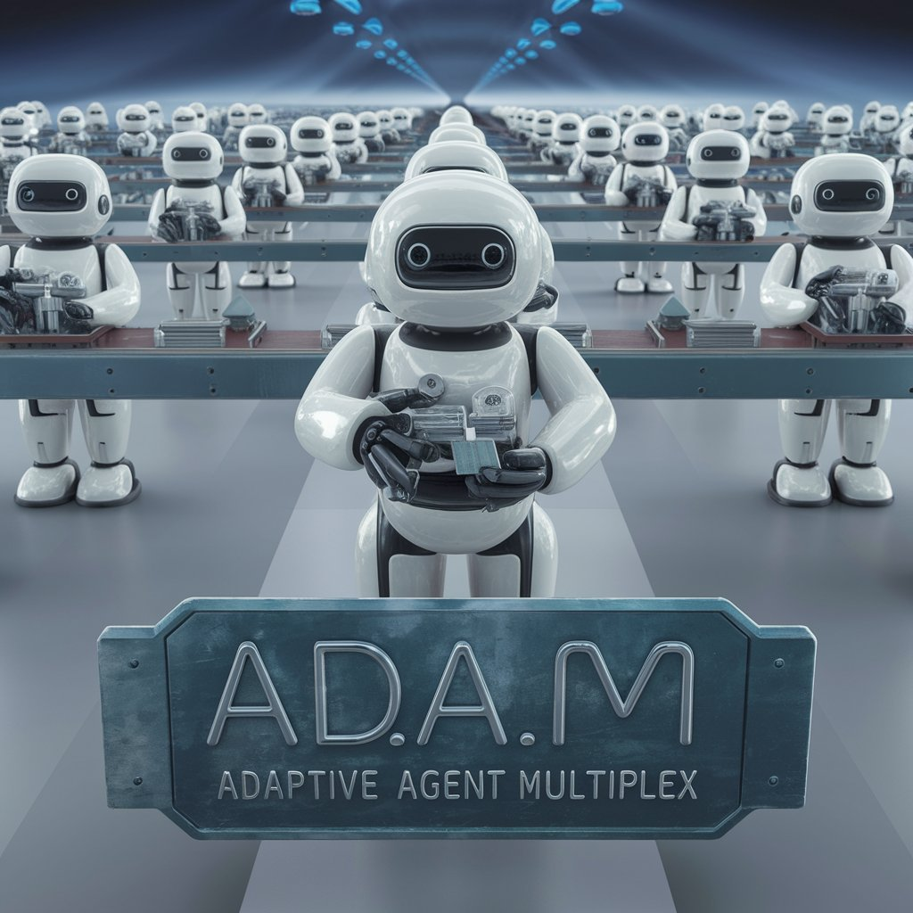

# Ad.A.M - Adaptive Agent Multiplex


Ad.A.M (Adaptive Agent Multiplex) is an innovative multi-agent system built using LangGraph, designed to process and refine user prompts with improved accuracy and context-awareness. At its core, Ad.A.M employs a workflow of constructor agents that dynamically build a team of specialized meta-agents tailored to answering user questions.

The system begins by rewriting and optimizing user inputs through prompt engineering techniques. It then extracts the core subject matter to create a dynamic expert system, where specialized agents are customized for the specific topic. These agents operate under the supervision of a meta-agent, which coordinates their activities to produce comprehensive and accurate responses.

Ad.A.M's approach allows for the division of complex problems into manageable units, each handled by specialized agents. This multi-agent design enables more accurate, contextually relevant, and tailored responses to user queries by leveraging a sophisticated network of AI agents and prompt optimization techniques.

## Node Map


This still needs a lot of work but here is the basic gist of the project...

1) To start the prompt gets re-written using prompt engineering. This prompt then get sent back to the human for them to tweak or agree with (this step is to emulate "active listening" where the agent rephrases the request and the human can let them know if they are on the right track. 2) The feedback then gets analysed to determine whether to proceed (feedback is simple affirmation) or if the human says pretty much anything else it will go back for review and to rewrite the prompt again.
3) Next the subject matter gets pulled out of the prompt and added into the state as a separate variable
4) The subject matter variable is used to make an ad hoc "expert" who will write the new system prompts (might need to add an extra node here to "write" the system prompt of the first expert if this approach doesn't work).
5) Then our expert writes the system prompts for our team of meta agents. This may require a separate LLM call for each system prompt and is where I want to spend most of the time iterating and improving. Might even have different team configurations run as inner graphs and the expert decides which one to use (this diagram only shows one simple three-agent team).
6) The system prompts then get inserted into the meta agents and they are fed the re-engineered prompt from the first step.
7) Once they are happy the response gets fed back to the human.


## Installation
Install poetry 
```angular2html
pip install poetry@1.8.2
```

```bash
# Fix the lock file (optionally fix)
poetry lock --no-update
```
```bash
# Install all the py packages via poetry
poetry install
```
If you are not inside a virtual env i.e.
```bash
poetry shell
```

Copy the `.env.example` and relabel it to `.env`.
To speed through and get something working, use the following settings instead.
```env
LANGCHAIN_TRACING_V2="false"
LANGCHAIN_API_KEY="" # Not needed 
LANGCHAIN_TRACING_V2 = "false"
LANGCHAIN_PROJECT = "AdAM"
COHERE_API_KEY = "<REQUIRED>" 
PROJECT_DIRECTORY = "AdAM/adam"
DEBUG="True"
```

Run this on the root directory (so at /AdAM directory)
```bash
poetry run py adam/main.pych
Hello, how can I help you today?

```